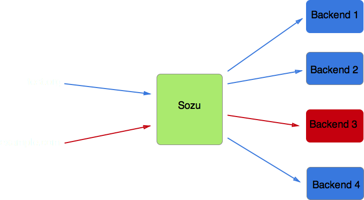
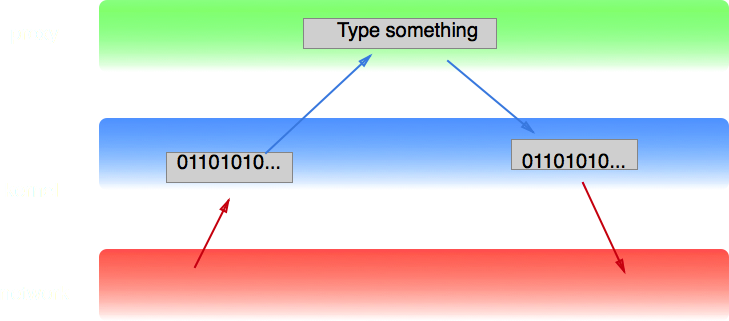

% modern techniques to write fast servers
% Geoffroy Couprie
% 2017-04-03

# Hi, I'm Geoffroy

* Security and QA at Clever Cloud
* Freelance consultant, security and architecture
* <span class="twitter">@gcouprie</span>
* geoffroy.couprie@clever-cloud.com

-------------------------------------------

# Announcement


-------------------------------------------

# reverse proxy



-------------------------------------------

# Sozu HTTP reverse proxy

- configuration at runtime
- fine grained configuration changes
- upgrades without downtime
- predictable memory usage

-------------------------------------------

# Good for

- load balancer for a large number of applications
- microservices

-------------------------------------------

## hot reconfiguration

- when you need a load balancer for a lot of backend servers
- with microservices that change very often
- blue/green deployments
- you can know when to stop a backend server (ie, when the last active connection to that server closed)
- it takes configuration diffs as input, it does not reload the complete configuration (dropping the previous one) like most existing solutions

-------------------------------------------

- sozu-lib: make your own proxy
- sozu: main executable
- sozu-command-lib: API to command sozu
- sozu-ctl: command line configuration app

-------------------------------------------

# We built a reverse proxy

- should never ever stop
- can handle thousands of frontend configurations, and backend servers
- it's open source
- https://github.com/sozu-proxy/sozu

-------------------------------------------

# Technical details

- written in Rust
- uses the nom parser combinators library
- supports HTTP 1 and TLS, HTTP/2 coming soon
- managed through a Unix socket
- multiprocess architecture

-------------------------------------------

## designed for speed and stability

-------------------------------------------

# what does it mean to be fast?

-------------------------------------------

total response time = network latency + service time + wait time

-------------------------------------------

## users only care about their own request

<details role="note">
- they don't care about how many requests are done concurrently on one or 100 machines
- they don't care about the latency of other requests
</details>

-------------------------------------------

wait time = N * ( service time + context switch )

-------------------------------------------

## how to reduce wait time?

-------------------------------------------

# measuring performance

averages VS percentiles

<details role="note">
we don't want to only have a good average performance
we also want to have low variance (show examples of systemms with good average response time but awful outliers)
side note: in an adversarial setting (security, etc), people will exploit the worst case over and over, even if it's usually rare (example: slowloris attack, and hashmap attacks)

we want to put a bound on the worst case response time => a request that is refused quickly is better than a timeout

</details>

-------------------------------------------

## How to measure? What do we measure?

- fix parameters: CPU, RAM, request size, etc
- augment gradually the number of concurrent requests
- measure response time percentiles
- measure timeouts
- go on until the system breaks up under the load

-------------------------------------------

## how to reduce wait time?

-------------------------------------------

## => horizontal scalability

use more resources, fix capacity?

-------------------------------------------

## => reduce context switches

how?

-------------------------------------------

## => reduce service time

optimize your code, maybe?

-------------------------------------------

# => lower latency in high percentiles

1ms more on service time for one request is 1ms more for every request

-------------------------------------------

# stable timings in high percentiles

- bounds on number of concurrent requests
- preallocate
- back pressure

-------------------------------------------

## reducing resource consumption

-------------------------------------------

# Server architecture

- blocking IO
- forking
- prefork
- multithreading

<details role="note">
historical techniques: forking model, prefork, multithread (one thread per request)
</details>

-------------------------------------------

## the C10k problem

- non blocking IO
- select, poll, epoll
- single threaded event loop

<details role="note">
WHY? resource consumption, context switches between threads

one process or one thread per request was easy to write: blocking IO model
but processes and threads are costly (in memory) and switching between them is costly (CPU, cache)

epoll became the fastest option: register a list of sockets to the OS, let the OS tell you when you can read or write on which sockets
epoll is for single threaded servers, but you can run epoll loops in multiple threads or processes
SO_REUSEPORT: available in Linux 3.9, since 2013

with this architecture, we only work when there's something to do with the sockets.
epoll will allow interleaving work: read from one socket, parse it, send to backend, read from another, now read from the first backend socket, send to frontend
</details>

-------------------------------------------

## Why reduce context switches between threads or process?

<details role="note">
It's time for some CPU architecture \o/
</details>

-------------------------------------------

## Modern CPU architecture

<details role="note">
show modern CPU architecture: cores, bus, caches
</details>

-------------------------------------------

```text
L1 cache reference      1   ns
Branch mispredict       3   ns
L2 cache reference      4   ns
Mutex lock/unlock      17   ns
Main memory reference 100   ns
```

-------------------------------------------

for 10000 requests, 1 L1 cache miss per req => 40ms more wait time per req

-------------------------------------------

program performance is dominated by cache misses

<details role="note">
(Cliff Click, Devoxx.be 2016)
</details>

-------------------------------------------

## context switches are costly

between 5 and 80ms per context switch

<details role="note">
switching between threads on a single core means loading the new thread's data in the cache if it's not there, and this takes time
</details>

-------------------------------------------

## core affinity

<details role="note">
use core affinity: if the threads jumped from one core to another, you need to reload the caches
</details>

-------------------------------------------

## shared nothing architecture

<details role="note">
- single thread architecture: everything happens in one thread, you can parallelize on multiple threads, but with no (or very low) interaction between them
- for data shared between processes and thread, use message queues and immutable data. Immutable data does not need to be synchronized
</details>


-------------------------------------------

## going further: multiqueue NICs

<details role="note">
https://blog.cloudflare.com/how-to-achieve-low-latency/
some network cards can have per core packet queues: every packet for one TCP connection go to the same core
with this single thread + core affinity architecture, we can use those network cards efficiently
</details>

-------------------------------------------

## reducing service time

<details role="note">
anything that augments service time will affect all the requests in flight, and will delay new requests
</details>

-------------------------------------------

# garbage collection is garbage

- increases wait time for everybody

<details role="note">
that's why garbage collection is such a big issue. Your system can be quite responsive most of the time, but if it is stopping processing to do garbage collection,
then wait time increases for every request.
a lot has been invested to make GC faster, especially in Go. But it still has a cost: going through objects (ie, loading them into the cache).
mark and sweep GC will flush the cache: going through all object
warning: potential trolling point here, might get grilled in the Q&A
</details>

-------------------------------------------

# in a proxy

- short lived objects, almost always same size
- long lived buffers, don't reallocate
- => preallocate

<details role="note">
for a network service like a proxy, garbage collection makes no sense: we don't create a lot of objects per request, and it's very regular.
an object pool and/or buffer pool is much better for our use cases

Rust has no garbage collection, it handles memory allocation and deallocation where it's needed
</details>

-------------------------------------------

## control plane VS data plane

<details role="note">
in telecoms, they viewed separately the control plane (SW and HW that chooses how to route data) and the data plane (where data effectively moves)

in a reverse proxy, we're on the control plane, we should not see much of the data plane
ie, we should see the HTTP headers and the chunk headers, but not the rest of the content
</details>

-------------------------------------------

# splicing



-------------------------------------------

# splicing


<details role="note">
what happens in most systems:
- read data from front socket into kernel buffer
- read headers from kernel buffer into front buffer
- parse headers from buffer to an object
- write object to back buffer
- write back buffer to back kernel buffer
- write back kernel buffer to back socket
- read body from front kernel buffer to buffer
- maybe copy body from front to back buffer
- write back buffer to back kernel buffer
- write back kernel buffer to back socket

what will happen in sozu (once splicing gets stable):
- read data from front socket into kernel buffer
- read headers from kernel buffer into front buffer
- parse headers from buffer to an object
- write header chunks from front buffer to back kernel buffer
- write back kernel buffer to back socket
- copy body from front kernel buffer to back kernel buffer
- write back kernel buffer to back socket

less copies, less context switching between kernel space and user space

currently, the proxy uses only one userspace buffer per request
</details>

-------------------------------------------

# Conclusion
- response time = network latency + service time + wait time
- wait time = N * ( service time + context switch )
- every nanosecond counts
- open source: https://github.com/sozu-proxy/sozu

