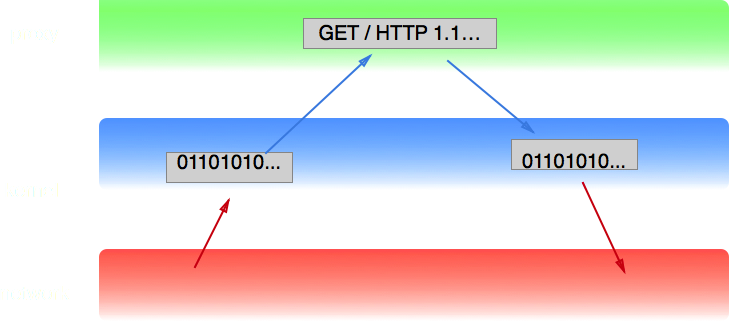

% Sōzu, a Modern Reverse Proxy Built for Immutable Infrastructure
% Geoffroy Couprie
% 2017-05-23

-------------------------------------------

# Hi, I'm Geoffroy

* Security and QA at Clever Cloud
* Freelance consultant, security and architecture
* <span class="twitter">@gcouprie</span>
* geoffroy.couprie@clever-cloud.com
* "that nom guy"

-------------------------------------------


-------------------------------------------

# 📣 Announcement 📣


-------------------------------------------

# reverse proxy


-------------------------------------------

# Sōzu HTTP reverse proxy

- should never EVER stop
- it's open source !
- https://github.com/sozu-proxy/sozu
- written in Rust !

-------------------------------------------


-------------------------------------------

# Good for

- load balancer for a large number of applications
- front server for microservices

-------------------------------------------

# Why we did it

changing configuration at runtime is hard

<details role="note">

- haproxy only suports full configuration reloads
- if you wipe the old conf, you don't get info like when to stop a backend server
- losing connections on reloads and upgrades
- easy when you have 10s of apps. Hard when you have 1000s

-------------------------------------------

# Why we did it

- changing configuration at runtime
- fine grained configuration changes

<details role="note">

- when you need a load balancer for a lot of backend servers
- with microservices that change very often
- blue/green deployments
- you can know when to stop a backend server (ie, when the last active connection to that server closed)
- it takes configuration diffs as input, it does not reload the complete configuration (dropping the previous one) like most existing solutions

</details>

-------------------------------------------

# Why we did it

- changing configuration at runtime
- fine grained configuration changes
- upgrades without downtime

<details role="note">

- when you need a load balancer for a lot of backend servers
- with microservices that change very often
- blue/green deployments
- you can know when to stop a backend server (ie, when the last active connection to that server closed)
- it takes configuration diffs as input, it does not reload the complete configuration (dropping the previous one) like most existing solutions
</details>

-------------------------------------------

# Why we did it

- changing configuration at runtime
- fine grained configuration changes
- upgrades without downtime
- predictable memory usage

<details role="note">

- when you need a load balancer for a lot of backend servers
- with microservices that change very often
- blue/green deployments
- you can know when to stop a backend server (ie, when the last active connection to that server closed)
- it takes configuration diffs as input, it does not reload the complete configuration (dropping the previous one) like most existing solutions

</details>

-------------------------------------------

# Why we did it

- changing configuration at runtime
- fine grained configuration changes
- upgrades without downtime
- predictable memory usage
- easy to write tools around

<details role="note">

- when you need a load balancer for a lot of backend servers
- with microservices that change very often
- blue/green deployments
- you can know when to stop a backend server (ie, when the last active connection to that server closed)
- it takes configuration diffs as input, it does not reload the complete configuration (dropping the previous one) like most existing solutions

</details>

-------------------------------------------


-------------------------------------------

## Let's look at the code!

-------------------------------------------

- main executable: **sozu**
- make your own proxy: **sozu-lib**
- API to command sōzu: **sozu-command-lib**
- command line configuration app: **sozu-ctl**

-------------------------------------------

# Technical details

- uses the nom parser combinators library
- epoll based
- supports HTTP 1 and TLS, HTTP/2 coming soon
- multiprocess architecture
- managed through a Unix socket

-------------------------------------------

# Reliability

-------------------------------------------

# Rust


-------------------------------------------

# Rust

- memory safe
- strong type system => easy refactoring
- no garbage collection

-------------------------------------------

# nom


-------------------------------------------

# what is nom?

- parser combinators
- macros

<details role="note">
I needed an easy way to write parsers
parser combinators are simple, they're just functions
easy to experiment

started in July 2014 (in another repo)
no impl Trait
no lifetime elision
closures?

fighting lifetime issues was (still is) a pain
compilation times
(well, compilation times can be hairy in rust, like the alt! bug)
</details>

-------------------------------------------

```rust
fn parser<I,O,E>(input: I) -> IResult<I, O, E>

pub enum IResult<Input,Output,E=u32> {
  // remaining input, result value
  Done(Input,Output),
  // error code with position
  Error(Err<Input,E>),
  //not enough data to decide
  Incomplete(Needed)
}
```

<details role="note">
EXPLAIN

Done contains output and remaining input
</details>

-------------------------------------------

```rust
named!(data,
  terminated!( alpha, digit )
);
```

<details role="note">
composition of functions

take time to explain here

macros are easy to write
a bit annoying to debug when you don't get the right types
some patterns are hard to express, like the permutation parser
parser combinators are easy to express
</details>

-------------------------------------------

```rust
fn data(input: &[u8]) -> IResult<&[u8], &[u8], u32> {
  match alpha(input) {
    Done(i, o) => {

      match digit(i) {
        Done(i2, _) => Done(i2, o),

        Incomplete(Needed::Size(i)) =>
          Incomplete(Needed::Size(
            input.input_len() - i.input_len() + i)),

        e => e,
      }
    },
    e => e
  }
}
```

-------------------------------------------

## what does it mean to "never ever stop" ?

-------------------------------------------


-------------------------------------------

# designing for stability

- how do we recover from failure?
- how can we avoid losing connections?
- how can we avoid restarting the process?

-------------------------------------------

## multiprocess architecture

-------------------------------------------

# multiprocess architecture

- restarting crashed workers

-------------------------------------------

# multiprocess architecture

- restarting crashed workers
- zero downtime upgrades

-------------------------------------------

# multiprocess architecture

- restarting crashed workers
- zero downtime upgrades
- sandboxing processes

-------------------------------------------

# multiprocess architecture

- restarting crashed workers
- zero downtime upgrades
- sandboxing processes
- perf optimization

-------------------------------------------

# "How can you trust a man who wears both a belt and suspenders? The man can't even trust his own pants."


-------------------------------------------

# Not losing connections on upgrade

- start new workers
- new workers start accepting connections
- old workers stop accepting connections
- old workers finish current connections then stop
- master forks to a new master
- new master takes over, old one stops

-------------------------------------------

# Actually not losing connections on upgrade

- no guarantees on the accept queue
- move the listening socket from old worker to new one

-------------------------------------------

## Workers

-------------------------------------------


-------------------------------------------

```rust
pub fn start_worker_process(id: &str, config: &Config)
  -> nix::Result<(pid_t, Channel<ProxyOrder,ServerMessage>)> {

  let (server, client) = UnixStream::pair().unwrap();
  let buffer_size = config.channel_buffer_size.unwrap_or(10000);

  match nix::fork() {
    ...
  }
}
```

-------------------------------------------

```rust
    Ok(ForkResult::Parent{ child }) => {
      let mut command:Channel<Config,ServerMessage> =
        Channel::new(server, buffer_size, buffer_size *2);
      command.set_nonblocking(false);

      command.write_message(config);

      command.set_nonblocking(true);
      let command: Channel<ProxyOrder,ServerMessage> =
        command.into();
      Ok((child, command))
    },
```

-------------------------------------------

```rust
    Ok(ForkResult::Child) => {
      let path = unsafe { get_executable_path() };

      Command::new(path.to_str().unwrap())
        .arg("worker")
        .arg("--fd").arg(client.as_raw_fd().to_string())
        .arg("--id").arg(id)
        .arg("--channel-buffer-size").arg(buffer_size.to_string())
        .exec();
      unreachable!();
    },

```

-------------------------------------------

```rust
pub fn begin_worker_process(fd: i32, id: &str,
  buffer_size: usize) {
  let mut command:Channel<ServerMessage,Config> =
    Channel::new(unsafe { UnixStream::from_raw_fd(fd) },
      buffer_size, buffer_size * 2 );
  command.set_nonblocking(false);

  let config = command.read_message().expect("worker error");

  command.set_nonblocking(true);
  let command : Channel<ServerMessage,ProxyOrder> =
    command.into();
```

-------------------------------------------

# changing configuration without restarts

- the master accepts configuration changes from a unix socket
- the master sends the configuration changes to workers
- the workers update their routing table
- the worker acknowledge the change

-------------------------------------------

# fine grained configuration changes

- do not replace the entire configuration at once
- work with diffs

-------------------------------------------

# configuration diffs

- add/remove frontend:    hostname+URL prefix => app id
- add/remove backend:     app id => IP+port
- add/remove certificate: a frontend uses a fingerprint as reference

-------------------------------------------

# Removing a backend server

- I received the order, but there are still connections
- not creating any new connections to that backend
- no more connections, you're free to remove it

-------------------------------------------

# Changing a certificate

- add new certificate
- add new frontends pointing to that new certificate
- remove frontends with the old fingerprint
- remove the old certificate
  - if there are still frontends using it, this will not work right away

-------------------------------------------

```rust
pub fn add_front(
  channel: &mut Channel<ConfigMessage,ConfigMessageAnswer>,
  app_id: &str, hostname: &str, path_begin: &str) {

  let id = generate_id();
  channel.write_message(&ConfigMessage::new(
    id.clone(),
    ConfigCommand::ProxyConfiguration(
      Order::AddHttpFront(HttpFront {
        app_id:     String::from(app_id),
        hostname:   String::from(hostname),
        path_begin: String::from(path_begin)
      })
    ),
    None,
  ));
```

-------------------------------------------

```rust
  match channel.read_message() {
    Some(message) => {
      if id != message.id {
        println!("message has invalid id: {:?}", message);
        return;
      }
      match message.status {
        ConfigMessageStatus::Error => {
          println!("could not add front: {}", message.message);
        },
        ConfigMessageStatus::Ok => {
          println!("Front configuration done");
        }
        ConfigMessageStatus::Processing => {
        },
      }
    },
    None          => println!("the proxy didn't answer")
  }
}
```

-------------------------------------------

# Emphasis on external tooling

- the proxy is just a pipe
- the proxy should not need implementations of Raft, etcd, Consul, Mesos, etc
- write tools to drive the proxy

-------------------------------------------

# Example: Let's Encrypt

- free, automated certificate authority
- request a verification from the CA
- the CA checks DNS records or calls a specific URI on the website
- once validated, you can download the certificate

-------------------------------------------

# Example: Let's Encrypt

- acme tool connects to the unix socket
- add frontend for the site's hostname and prefix for the predefined URI
- start a local webserver
- add backend for this webserver, connected to this frontend
- request verification from Let's Encrypt
- download certificate
- remove the custom frontend and backend
- give the new certificate to the proxy, remove the old one

-------------------------------------------

# Conclusion

- young project, but designed for production
- good way to learn low level networking
- easy to build tools around
- lots of E-EASY issues ;)

-------------------------------------------

# future work

- 3 process arch: TCP load balancer, router, manager
- terminating TLS at the backend server
- kubernetes, consul, etcd, etc. support
- Let's Encrypt
- splicing
- HTTP/2

-------------------------------------------

## We need your help!

-------------------------------------------

# Sōzu


-------------------------------------------


-------------------------------------------

# Thank you!

- https://github.com/sozu-proxy/sozu
- https://clever-cloud.com
- twitter: @gcouprie

-------------------------------------------

## GIVE ME MORE

-------------------------------------------

# splicing



-------------------------------------------

# splicing


<details role="note">
what happens in most systems:
- read data from front socket into kernel buffer
- read headers from kernel buffer into front buffer
- parse headers from buffer to an object
- write object to back buffer
- write back buffer to back kernel buffer
- write back kernel buffer to back socket
- read body from front kernel buffer to buffer
- maybe copy body from front to back buffer
- write back buffer to back kernel buffer
- write back kernel buffer to back socket

what will happen in sozu (once splicing gets stable):
- read data from front socket into kernel buffer
- read headers from kernel buffer into front buffer
- parse headers from buffer to an object
- write header chunks from front buffer to back kernel buffer
- write back kernel buffer to back socket
- copy body from front kernel buffer to back kernel buffer
- write back kernel buffer to back socket

less copies, less context switching between kernel space and user space

currently, the proxy uses only one userspace buffer per request
</details>

-------------------------------------------

## memory usage

-------------------------------------------

## single threaded

-------------------------------------------

## core affinity

-------------------------------------------

## Why reduce context switches between threads or process?

<details role="note">
It's time for some CPU architecture \o/
</details>

-------------------------------------------

## multiqueue NICs

-------------------------------------------

# Server architecture

- blocking IO
- forking
- prefork
- multithreading

<details role="note">
historical techniques: forking model, prefork, multithread (one thread per request)
</details>

-------------------------------------------

# the C10k problem

- non blocking IO
- select, poll, epoll
- single threaded event loop

<details role="note">
WHY? resource consumption, context switches between threads

one process or one thread per request was easy to write: blocking IO model
but processes and threads are costly (in memory) and switching between them is costly (CPU, cache)

epoll became the fastest option: register a list of sockets to the OS, let the OS tell you when you can read or write on which sockets
epoll is for single threaded servers, but you can run epoll loops in multiple threads or processes
SO_REUSEPORT: available in Linux 3.9, since 2013

with this architecture, we only work when there's something to do with the sockets.
epoll will allow interleaving work: read from one socket, parse it, send to backend, read from another, now read from the first backend socket, send to frontend
</details>

